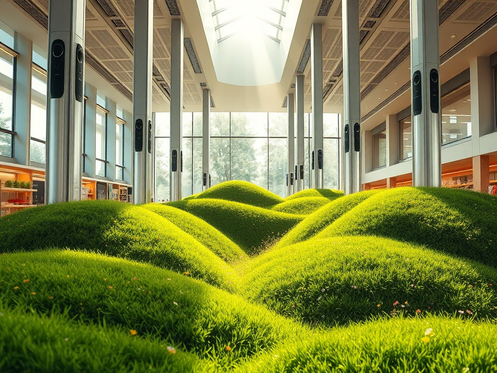

# Indoor_Park
Indoor park concept that requires less energy than a typical indoor theme park. This is not a theme park. It is more like a large climate simulator where the air is ultra-processed. Imagine a transporter that could take you to a different climate.

* The air is allowed to be hotter or colder than a typical building (heating could be ignored)
* Air is processed using pressure swing absorption and membrane separation technologies
* The air is kept at the normal 21 percent oxygen levels
* How the air is conditioned is based on the weather conditions or atmospheric influence
* Plenty of ventilation is used to mitigated inaccurate air processing
* Safety is sought through redundancy and multi-person upkeep
